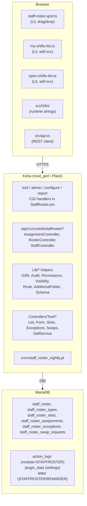
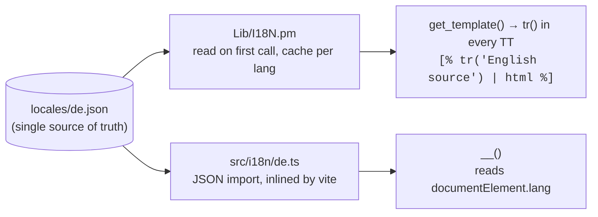

# Architecture

A map of how the pieces fit together. Useful when reading code or
deciding where to add something.

## Layers

## File guide

| Path | Purpose |
|---|---|
| `Koha/Plugin/Xyz/Paulderscheid/StaffRoster.pm` | Main module: install / upgrade / uninstall, lifecycle hooks, every CGI handler (tool / admin / configure / report), helper SQL, RRule helpers, `_audit` wrapper, `_has_perm` / `_gate`, library-group walk, calendar merge. |
| `…/StaffRoster/AssignmentController.pm` | REST endpoints for assignments + self-service (`create`, `update`, `delete`, `bulk`, `self_create`, `self_delete`). Owns `_conflict_check`, `_gate_slot`, `_load`, and the JSON↔column boundary mappers (`_from_body`, `_to_response`). |
| `…/StaffRoster/RosterController.pm` | REST endpoint for the per-roster week view (`get_week`). Joins slots + assignments + additional fields + exceptions (with calendar merge) for the visible 7-day window. |
| `…/StaffRoster/StaffController.pm` | REST: `/staff/available` (filtered staff for the picker), `/me/week`, `/me/open_slots`. |
| `…/StaffRoster/Lib/I18N.pm` | Loads `locales/<lang>.json`, exposes `translator()` returning a closure bound to the current Koha language. |
| `…/StaffRoster/locales/de.json` | German UI dictionary; English keys → German values. Shared by Perl + JS. |
| `…/StaffRoster/openapi.json` | OpenAPI 2 spec for every plugin REST route. |
| `…/StaffRoster/staticapi.json` | Static asset routes (`/staff-roster.js`, `.css`, plugin CSS). |
| `…/StaffRoster/*.tt` | Tool / admin / configure / report templates. Use `[% tr('English') | html %]` for translatable strings. |
| `src/api.ts` | Typed REST client, one function per endpoint. |
| `src/components/staff-roster-grid.ts` | The drag-and-drop schedule grid (Lit). 1000+ lines, owns its own polling, undo stack, focus management, three EscapeControllers. |
| `src/components/my-shifts-list.ts` | "My shifts" view (Lit). |
| `src/components/open-shifts-list.ts` | "Open shifts" view (Lit). |
| `src/components/shared/` | `toolbar`, `toasts`, `modal`, `day-groups`, `escape-controller` — small reusable bits. |
| `src/i18n/index.ts` + `de.ts` | Lit-side translation shim. `de.ts` re-exports the JSON so Perl + JS share one source. |
| `src/labels.ts` | Shared `STATUS_LABELS` map (assignment status → translated label) consumed by the grid + my-shifts list. |
| `t/*.t` | Plugin tests. Run inside the kohadev container via `prove`. |
| `cypress/integration/staffroster/` | Cypress integration specs (real REST round-trip). Run via `just test-cypress`; reuses ktd's bundled cypress install. |
| `cron/staff_roster_nightly.pl` | Cron runner, calls `cronjob_nightly`. |

## Request shapes

REST routes live under `/api/v1/contrib/staffroster/`.

| Method | Path | Handler | Notes |
|---|---|---|---|
| GET | `/rosters/{roster_id}/week?start=YYYY-MM-DD` | `RosterController#get_week` | Aggregated week view |
| GET | `/staff/available?date=…&slot_id=…&q=…` | `StaffController#available` | Drag source for the grid |
| GET | `/me/week?start=…` | `StaffController#me_week` | Own assignments |
| GET | `/me/open_slots?start=…` | `StaffController#me_open_slots` | Self-service feed |
| POST | `/assignments` | `AssignmentController#create` | Manager assigns |
| PUT | `/assignments/{id}` | `AssignmentController#update` | Manager edits |
| DELETE | `/assignments/{id}` | `AssignmentController#delete` | Manager removes |
| POST | `/assignments/bulk` | `AssignmentController#bulk` | Move/clear N assignments |
| POST | `/me/claim` | `AssignmentController#self_create` | Self-claim |
| DELETE | `/me/claim/{id}` | `AssignmentController#self_delete` | Self-drop |

## Translation flow

Both branches fall through to the English source when a key is missing,
so a partial translation never breaks a page.

The dictionary keys are the English source strings, not opaque
codes — this means a missing translation degrades gracefully to
English instead of breaking the page.

## Settings flow

Plugin settings live in the `plugin_data` table keyed by
`plugin_class`. Read via `$self->retrieve_data($key)`, written via
`$self->store_data({ k => v })`. The configure form handler
reads a fixed list of keys, persists them in one call, and
re-paints the form.

## Audit log

Every mutation calls `_audit($action, $object_id, $infos,
$original)`. The wrapper forwards to
`C4::Log::logaction('STAFFROSTER', $action, $object_id, $infos,
undef, $original)`. The 6th argument is what enables the
post-Bug 25159 JSON Diff machinery — the diff column on
`action_logs` shows pre/post for `MODIFY`, full row for `CREATE`
and `DELETE`. Cron `NOTICE` / `NOTICE_FAILED` entries skip
`$original` because they're notification events, not row
mutations.

## Recurring slots (RRule)

Slots store an iCal RFC 5545 RRULE in `recurrence_rule`. Supported
subset:

- `FREQ=WEEKLY` — every picked weekday
- `FREQ=MONTHLY` with `BYDAY` ordinals (`1MO`, `-1FR`)
- `INTERVAL` — every Nth week / month
- `UNTIL` — end date

The hot path (weekly + interval=1 + no until) skips
`DateTime::Event::ICal` with a fast Perl check; richer rules
delegate to the library. The week response decorates each slot
with an `applies_on_dates: [YYYY-MM-DD,…]` array so the client
can filter cell visibility without re-evaluating the rule.

## Tests

`t/00-load.t` walks every `.pm` and `use_ok`s it. The other
files are story-style integration tests against the kohadev
container's live MariaDB, wrapped in `AutoCommit=0` + rollback so
nothing leaks between runs. See the README for the prove
invocation.

`cypress/integration/staffroster/` covers the live REST round-trip
(`get_week` calendar merge, applies_on_dates, exception precedence)
and a grid render assertion that locks in the column-date
derivation. Specs reuse `_fixtures.ts` (`createRosterFixture` /
`cleanupRosterFixture`) for namespaced setup + teardown. Run via
`just test-cypress` — the helper syncs the plugin into the kohadev
container, restarts Plack, and invokes ktd's bundled cypress.

## Where to start a new feature

| Want to add… | Touch… |
|---|---|
| A new mutation endpoint | `openapi.json` + a controller method + an `_audit` call |
| A new tool view | A new `op` branch in `tool` + a new TT block (or include) |
| A new setting | `@config_keys` + the `configure.tt` form + a reader on the consumer side |
| A new Lit component | `src/components/<name>.ts` + import in `src/index.ts` + bundle rebuild |
| A new locale | `locales/<lang>.json` + `src/i18n/<lang>.ts` + re-export from `src/i18n/index.ts` |
| A new sub-permission | `%SUBPERMISSIONS` in `_register_permissions` + an `_has_perm` call at the gate site + a label in `intranet_js` |
