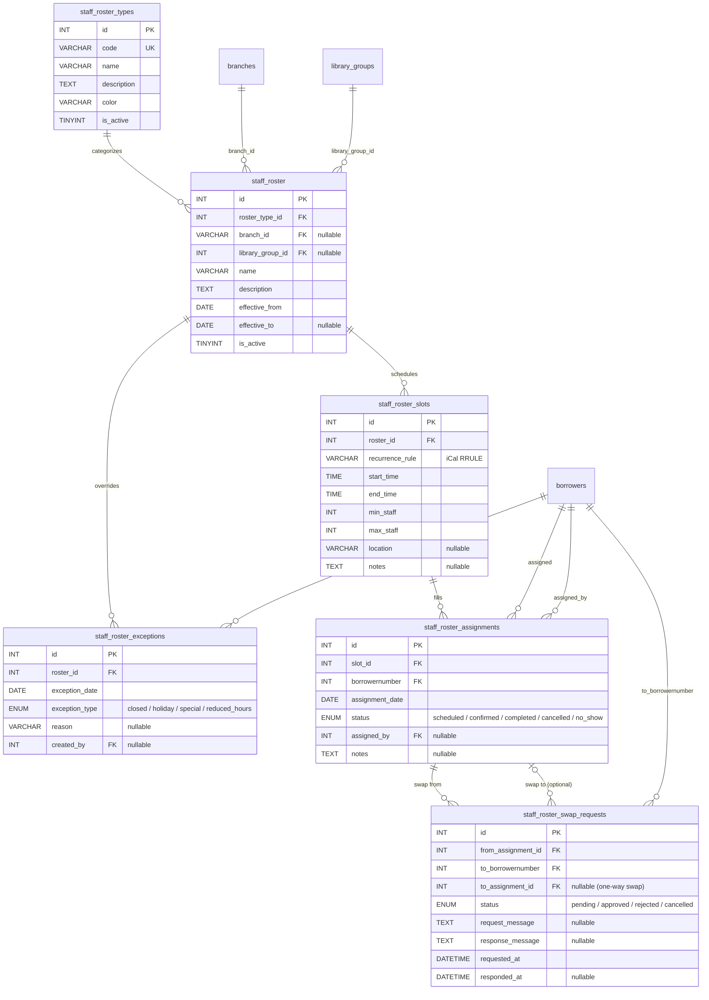

# Staff Roster Plugin - Database Schema Design

## Overview

This document describes the database schema for the Staff Roster plugin, which manages
staff assignments for various duties (desk duty, reference desk, etc.) across library
branches and locations.

## Core Concepts

1. **Roster Types** - Categories of duties (e.g., "Circulation Desk", "Reference Desk", "Children's Section")
2. **Rosters** - A schedule template that defines recurring patterns
3. **Roster Slots** - Individual time slots within a roster (e.g., Monday 9am-12pm)
4. **Roster Assignments** - Staff member assigned to a specific slot on a specific date
5. **Roster Exceptions** - Overrides for holidays, closures, or special circumstances

## Entity Relationship Diagram



## Table Definitions

### 1. staff_roster_types

Defines the categories/types of roster duties.

| Column      | Type         | Constraints          | Description                              |
|-------------|--------------|----------------------|------------------------------------------|
| id          | INT          | PK, AUTO_INCREMENT   | Unique identifier                        |
| code        | VARCHAR(50)  | UNIQUE, NOT NULL     | Short code (e.g., 'CIRC', 'REF')         |
| name        | VARCHAR(255) | NOT NULL             | Display name                             |
| description | TEXT         | NULL                 | Detailed description                     |
| color       | VARCHAR(7)   | DEFAULT '#3498db'    | Hex color for UI display                 |
| is_active   | TINYINT(1)   | DEFAULT 1            | Whether this type is currently in use    |
| created_at  | DATETIME     | NOT NULL             | Record creation timestamp                |
| updated_at  | DATETIME     | NOT NULL             | Last update timestamp                    |

### 2. staff_roster

Main roster/schedule definition table.

| Column           | Type         | Constraints          | Description                              |
|------------------|--------------|----------------------|------------------------------------------|
| id               | INT          | PK, AUTO_INCREMENT   | Unique identifier                        |
| roster_type_id   | INT          | FK, NOT NULL         | Reference to staff_roster_types          |
| branch_id        | VARCHAR(10)  | FK, NULL             | Single-branch scope (NULL when group/all) |
| library_group_id | INT          | FK, NULL             | Library-group scope (NULL when branch/all). Mutually exclusive with branch_id at the app level. |
| name             | VARCHAR(255) | NOT NULL             | Roster name                              |
| description      | TEXT         | NULL                 | Detailed description                     |
| effective_from   | DATE         | NOT NULL             | Start date of roster validity            |
| effective_to     | DATE         | NULL                 | End date (NULL = indefinite)             |
| is_active        | TINYINT(1)   | DEFAULT 1            | Whether roster is currently active       |
| created_at       | DATETIME     | NOT NULL             | Record creation timestamp                |
| updated_at       | DATETIME     | NOT NULL             | Last update timestamp                    |

### 3. staff_roster_slots

Defines the recurring time slots within a roster. Recurrence is stored
as an iCal RFC 5545 RRULE in `recurrence_rule` (e.g.
`FREQ=WEEKLY;BYDAY=MO,WE,FR`); see Architecture.md for the supported
subset.

| Column          | Type         | Constraints          | Description                              |
|-----------------|--------------|----------------------|------------------------------------------|
| id              | INT          | PK, AUTO_INCREMENT   | Unique identifier                        |
| roster_id       | INT          | FK, NOT NULL         | Reference to staff_roster                |
| recurrence_rule | VARCHAR(512) | NOT NULL             | iCal RRULE subset (FREQ + BYDAY ± INTERVAL/UNTIL/MONTHLY ordinals) |
| start_time      | TIME         | NOT NULL             | Slot start time                          |
| end_time        | TIME         | NOT NULL             | Slot end time                            |
| min_staff       | INT          | DEFAULT 1            | Minimum staff required                   |
| max_staff       | INT          | DEFAULT 1            | Maximum staff allowed                    |
| location        | VARCHAR(255) | NULL                 | Specific location/desk within branch     |
| notes           | TEXT         | NULL                 | Notes about this slot                    |
| created_at      | DATETIME     | NOT NULL             | Record creation timestamp                |
| updated_at      | DATETIME     | NOT NULL             | Last update timestamp                    |

### 4. staff_roster_assignments

Actual staff assignments to slots on specific dates.

| Column           | Type         | Constraints          | Description                              |
|------------------|--------------|----------------------|------------------------------------------|
| id               | INT          | PK, AUTO_INCREMENT   | Unique identifier                        |
| slot_id          | INT          | FK, NOT NULL         | Reference to staff_roster_slots          |
| borrowernumber   | INT          | FK, NOT NULL         | Reference to Koha borrowers (staff)      |
| assignment_date  | DATE         | NOT NULL             | Specific date of assignment              |
| status           | ENUM         | DEFAULT 'scheduled'  | 'scheduled', 'confirmed', 'completed', 'cancelled', 'no_show' |
| assigned_by      | INT          | FK, NULL             | Who made this assignment                 |
| notes            | TEXT         | NULL                 | Assignment-specific notes                |
| created_at       | DATETIME     | NOT NULL             | Record creation timestamp                |
| updated_at       | DATETIME     | NOT NULL             | Last update timestamp                    |

**Unique Constraint**: (slot_id, borrowernumber, assignment_date) - prevents duplicate assignments

### 5. staff_roster_exceptions

Handles schedule exceptions (holidays, closures, special events).

| Column          | Type         | Constraints          | Description                              |
|-----------------|--------------|----------------------|------------------------------------------|
| id              | INT          | PK, AUTO_INCREMENT   | Unique identifier                        |
| roster_id       | INT          | FK, NOT NULL         | Reference to staff_roster                |
| exception_date  | DATE         | NOT NULL             | Date of the exception                    |
| exception_type  | ENUM         | NOT NULL             | 'closed', 'holiday', 'special', 'reduced_hours' |
| reason          | VARCHAR(255) | NULL                 | Reason for exception                     |
| created_by      | INT          | FK, NULL             | Who created this exception               |
| created_at      | DATETIME     | NOT NULL             | Record creation timestamp                |
| updated_at      | DATETIME     | NOT NULL             | Last update timestamp                    |

### 6. staff_roster_swap_requests

Manages shift swap requests between staff members.

| Column             | Type         | Constraints          | Description                              |
|--------------------|--------------|----------------------|------------------------------------------|
| id                 | INT          | PK, AUTO_INCREMENT   | Unique identifier                        |
| from_assignment_id | INT          | FK, NOT NULL         | Assignment being offered for swap        |
| to_borrowernumber  | INT          | FK, NOT NULL         | Staff member being asked to swap         |
| to_assignment_id   | INT          | FK, NULL             | Assignment offered in exchange (if any)  |
| status             | ENUM         | DEFAULT 'pending'    | 'pending', 'approved', 'rejected', 'cancelled' |
| request_message    | TEXT         | NULL                 | Message from requester                   |
| response_message   | TEXT         | NULL                 | Response from recipient                  |
| requested_at       | DATETIME     | NOT NULL             | When request was made                    |
| responded_at       | DATETIME     | NULL                 | When response was given                  |
| created_at         | DATETIME     | NOT NULL             | Record creation timestamp                |
| updated_at         | DATETIME     | NOT NULL             | Last update timestamp                    |

## Indexes

### Performance Indexes

```sql
-- Assignments lookup by date range
CREATE INDEX idx_assignments_date ON staff_roster_assignments(assignment_date);

-- Assignments by staff member
CREATE INDEX idx_assignments_staff ON staff_roster_assignments(borrowernumber, assignment_date);

-- Slots by roster (recurrence is computed in Perl, not indexable)
CREATE INDEX idx_slots_roster ON staff_roster_slots(roster_id);

-- Exceptions by roster and date
CREATE INDEX idx_exceptions_roster_date ON staff_roster_exceptions(roster_id, exception_date);

-- Active rosters by branch
CREATE INDEX idx_roster_branch_active ON staff_roster(branch_id, is_active, effective_from, effective_to);

-- Swap requests by status
CREATE INDEX idx_swap_status ON staff_roster_swap_requests(status, requested_at);
```

## Foreign Key Relationships

```sql
-- staff_roster -> staff_roster_types
ALTER TABLE staff_roster 
    ADD CONSTRAINT fk_roster_type 
    FOREIGN KEY (roster_type_id) REFERENCES staff_roster_types(id) 
    ON DELETE RESTRICT ON UPDATE CASCADE;

-- staff_roster -> branches
ALTER TABLE staff_roster 
    ADD CONSTRAINT fk_roster_branch 
    FOREIGN KEY (branch_id) REFERENCES branches(branchcode) 
    ON DELETE SET NULL ON UPDATE CASCADE;

-- staff_roster_slots -> staff_roster
ALTER TABLE staff_roster_slots 
    ADD CONSTRAINT fk_slot_roster 
    FOREIGN KEY (roster_id) REFERENCES staff_roster(id) 
    ON DELETE CASCADE ON UPDATE CASCADE;

-- staff_roster_assignments -> staff_roster_slots
ALTER TABLE staff_roster_assignments 
    ADD CONSTRAINT fk_assignment_slot 
    FOREIGN KEY (slot_id) REFERENCES staff_roster_slots(id) 
    ON DELETE CASCADE ON UPDATE CASCADE;

-- staff_roster_assignments -> borrowers
ALTER TABLE staff_roster_assignments 
    ADD CONSTRAINT fk_assignment_staff 
    FOREIGN KEY (borrowernumber) REFERENCES borrowers(borrowernumber) 
    ON DELETE CASCADE ON UPDATE CASCADE;

-- staff_roster_assignments -> borrowers (assigned_by)
ALTER TABLE staff_roster_assignments 
    ADD CONSTRAINT fk_assignment_assigned_by 
    FOREIGN KEY (assigned_by) REFERENCES borrowers(borrowernumber) 
    ON DELETE SET NULL ON UPDATE CASCADE;

-- staff_roster_exceptions -> staff_roster
ALTER TABLE staff_roster_exceptions 
    ADD CONSTRAINT fk_exception_roster 
    FOREIGN KEY (roster_id) REFERENCES staff_roster(id) 
    ON DELETE CASCADE ON UPDATE CASCADE;

-- staff_roster_exceptions -> borrowers
ALTER TABLE staff_roster_exceptions 
    ADD CONSTRAINT fk_exception_created_by 
    FOREIGN KEY (created_by) REFERENCES borrowers(borrowernumber) 
    ON DELETE SET NULL ON UPDATE CASCADE;

-- staff_roster_swap_requests -> staff_roster_assignments
ALTER TABLE staff_roster_swap_requests 
    ADD CONSTRAINT fk_swap_from_assignment 
    FOREIGN KEY (from_assignment_id) REFERENCES staff_roster_assignments(id) 
    ON DELETE CASCADE ON UPDATE CASCADE;

-- staff_roster_swap_requests -> borrowers
ALTER TABLE staff_roster_swap_requests 
    ADD CONSTRAINT fk_swap_to_staff 
    FOREIGN KEY (to_borrowernumber) REFERENCES borrowers(borrowernumber) 
    ON DELETE CASCADE ON UPDATE CASCADE;

-- staff_roster_swap_requests -> staff_roster_assignments (optional)
ALTER TABLE staff_roster_swap_requests 
    ADD CONSTRAINT fk_swap_to_assignment 
    FOREIGN KEY (to_assignment_id) REFERENCES staff_roster_assignments(id) 
    ON DELETE SET NULL ON UPDATE CASCADE;
```

## Sample Queries

### Get today's roster for a branch

```sql
SELECT 
    srt.name AS duty_type,
    sr.name AS roster_name,
    srs.start_time,
    srs.end_time,
    srs.location,
    CONCAT(b.firstname, ' ', b.surname) AS staff_name,
    sra.status
FROM staff_roster_assignments sra
JOIN staff_roster_slots srs ON sra.slot_id = srs.id
JOIN staff_roster sr ON srs.roster_id = sr.id
JOIN staff_roster_types srt ON sr.roster_type_id = srt.id
JOIN borrowers b ON sra.borrowernumber = b.borrowernumber
WHERE sra.assignment_date = CURDATE()
  AND sr.branch_id = 'MAIN'
  AND sr.is_active = 1
  AND NOT EXISTS (
      SELECT 1 FROM staff_roster_exceptions sre 
      WHERE sre.roster_id = sr.id 
        AND sre.exception_date = CURDATE()
  )
ORDER BY srs.start_time, srt.name;
```

### Get staff member's upcoming assignments

```sql
SELECT 
    sra.assignment_date,
    srs.start_time,
    srs.end_time,
    srt.name AS duty_type,
    sr.name AS roster_name,
    srs.location
FROM staff_roster_assignments sra
JOIN staff_roster_slots srs ON sra.slot_id = srs.id
JOIN staff_roster sr ON srs.roster_id = sr.id
JOIN staff_roster_types srt ON sr.roster_type_id = srt.id
WHERE sra.borrowernumber = ?
  AND sra.assignment_date >= CURDATE()
  AND sra.status IN ('scheduled', 'confirmed')
ORDER BY sra.assignment_date, srs.start_time;
```

### Find unfilled slots for a date range

Recurrence lives in `recurrence_rule` as an iCal RRULE, not a simple
`day_of_week` column, so the "does this slot apply on this date" check
isn't pure SQL. The plugin's
`Lib::Rrule::slot_applies_on($rrule, $date, $anchor)` helper covers
the WEEKLY + MONTHLY + ordinal subset; the canonical aggregator lives
in `RosterController#get_week`, which returns a per-day applicability
list alongside the slot. To find unfilled slots offline, walk the
date range in Perl and filter by `slot_applies_on` before joining
against the assignment count.

## Version History

| Version | Date       | Changes                          |
|---------|------------|----------------------------------|
| 1.0.0   | 2025-12-30 | Initial schema design            |

## Notes

- All tables are prefixed with `staff_roster_` to avoid conflicts with Koha core tables
- Foreign keys reference Koha's `borrowers` table for staff members and `branches` table for locations
- The schema supports multi-branch deployments with optional branch-specific rosters
- Timestamps use DATETIME for consistency with Koha conventions
- ENUM types are used for status fields to ensure data integrity
